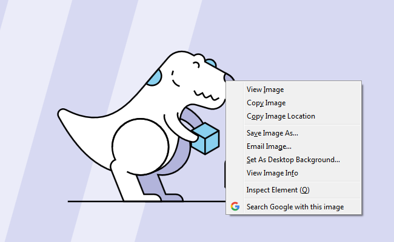

# Google Search By Image 

[][amo]
[][amo]
[][amo]
[][amo]

> A Firefox extension that adds Google’s "search by image" search to the context menu shown when you right click on an image.

	

## Pros
- Fast!
- No excessive permission requests

## Restrictions
- Only works with `http` & `https` URLs (not `file`, `ftp`, `data`, etc.)

## Development

Testing unsigned extensions only works with [non-release builds](https://developer.mozilla.org/en-US/Add-ons/WebExtensions/Getting_started_with_web-ext#Testing_unsigned_extensions) of Firefox, to develop the extension:
1. Install a [non-release build](https://developer.mozilla.org/en-US/Add-ons/WebExtensions/Getting_started_with_web-ext#Testing_unsigned_extensions) (e.g. Firefox Developer Edition)
1. `npm install`
1. `npm run start` to load Firefox Developer Edition with the extension installed. Making changes to the code will automatically reload the extension.

## Release Process

To publish a new version:

1. `npm run test`
1. Bump the `version` in `src/manifest.json`
1. Commit with the version number as the commit message (e.g. `:bookmark: 1.0.0`) and tag the commit with the version number (e.g. `v1.0.0`)
1. `npm run package` to bundle the extension as a `zip` file
1. Upload the generated `zip` to https://addons.mozilla.org/en-US/developers/addons

[amo]: https://addons.mozilla.org/en-GB/firefox/addon/google-search-by-image-new
